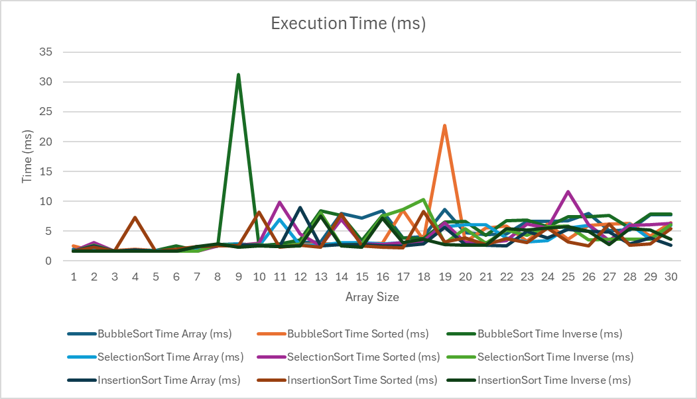
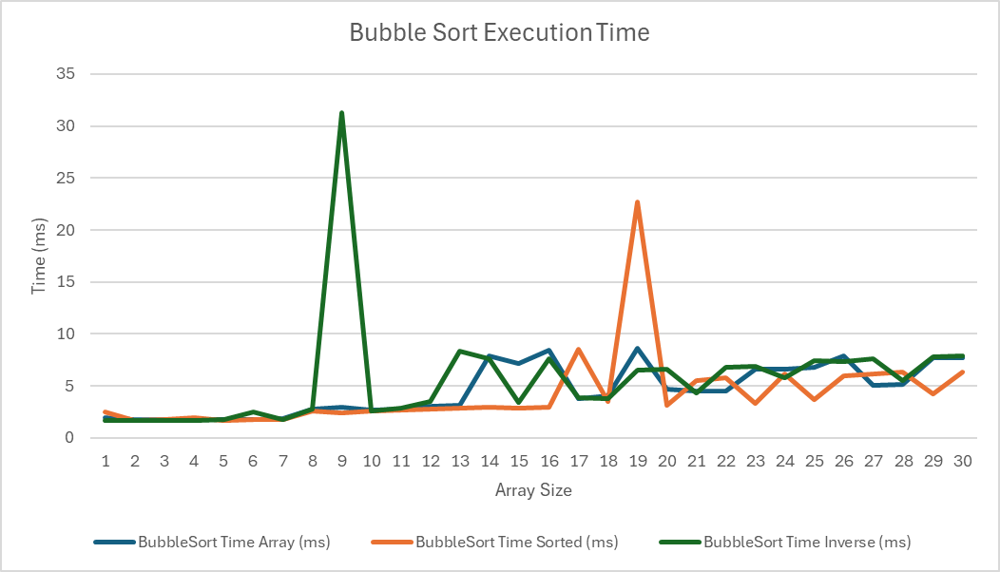
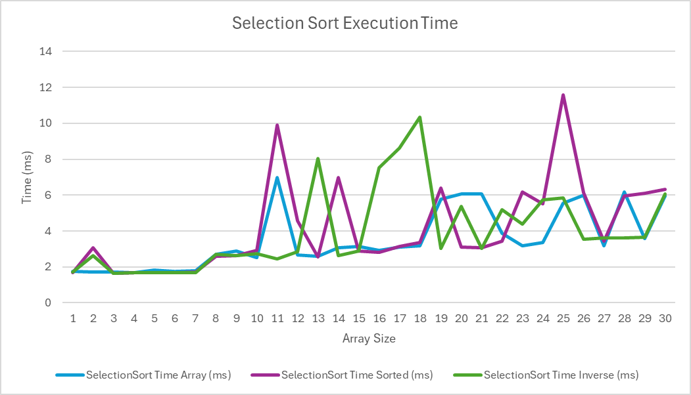
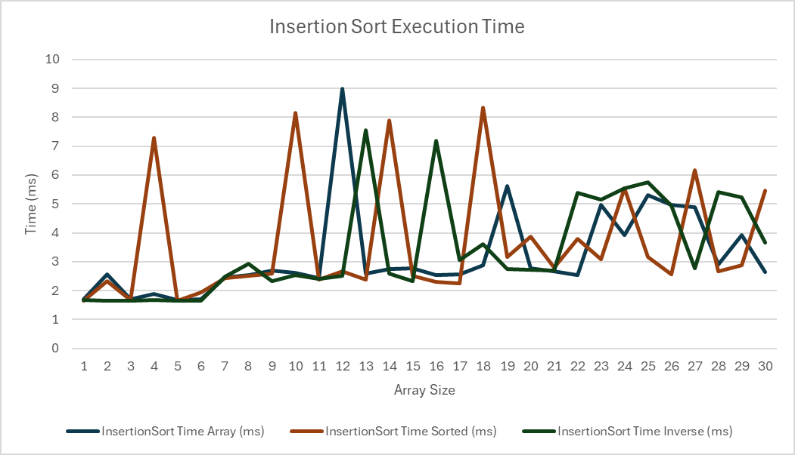

# Task 1 - Sorting Algorithms Analysis

# 1. Task Overview and Algorithm Selection

The purpose of this task is to analyze the comparison count and the processing time of three of the most well known sorting algorithms that exists: Bubble Sort, Selection Sort, and Insertion Sort. These metrics are evaluated across three variants of input data: randomly ordered array or (scattered array), sorted, and inversely-sorted arrays, with sizes ranging from 1 to 30.

## Algorithms Used

## Bubble Sort

## Insertion Sort

## Selection Sort

## NOTE: NO OTHER ALGORITHMS WHERE USED EXCEPT ONES THAT WERE MENTIONED IN THE TASK DOCUMENT

# 2. Differences Between Sorting Algorithms

## 1. Bubble Sort

A Bubble Sort algorithm iterates over the entire array/list for each index except the last. On each index $i$, a check is being done to compare the current index $i$ to the next index $i+1$. If the next index’s value is bigger, a swap is done between the two indices respectively.

## 2. Selection Sort

A Selection Sort algorithm picks an index and checks through the entire array until the smallest value is found. If a smaller value is found, a swap occurs. Unlike Bubble Sort, it is not limited to comparing with the next index only — the value being compared could exist anywhere in the entire array.

## 3. Insertion Sort

An Insertion Sort algorithm holds a key which is a value of the current index for every iteration noting that this algorithm must start on the second element and not the first. With an index which is the previous index of the current iteration. Rather than swapping the neighbouring index similar to the bubble sort or be flexible like the Selection Sort, It works by shifting elements into the indexes previous to it by copying the $i$ to $i-1$ index’s value and swapping the beginning and the end placing the key into it’s correct position.

# 3. Code & Detailed Explanation

## Bubble Sort Count

```cpp
int bubble_sort_count(int* arr, int n) {
    // Create Comparison Counter
    int count = 0;
    // Pass Through Array Based on It's Size
    for (int i = 0; i < n; i++) { 
        // Compare The Element of The Current Array With The Next Index
        for (int j = 0; j < n - 1 - i; j++) { 
            // Increment Comparison Counter
            count++; 
            // If Current Value is bigger than the next index's Value Perform A Swap Operation
            if (arr[j] > arr[j+1]) {
                // Swap Elements
                int temp = arr[j]; 
                arr[j] = arr[j+1];
                arr[j+1] = temp;
            }
        }
    }
    // Return Comparison Count Number
    return count; 
}
```

## Selection Sort Count

```cpp
int selection_sort_count(int* arr, int n) {
    // Create Comparison Counter
    int count = 0;
    // Select all positions in the array except the last index
    for (int i = 0; i < n - 1; i++) { 
        // Assume on each iteration the current index is has the minimum value
        int minIndex = i; 
        // Iterate over elements that are left to the current index searching for lowest value to swap
        for (int j = i + 1; j < n; j++) {
            // Increment Comparison Counter
            count++;
            // Update minIndex if a smaller element is found
            if (arr[j] < arr[minIndex]) {
                // Set new minimum index
                minIndex = j;
            }
        }
        // Swap Elements between current position and with the value set in the minIndex index 
        int temp = arr[minIndex];
        arr[minIndex] = arr[i];
        arr[i] = temp;
    }
    // Return Comparison Count Number
    return count;
}
```

## Insertion Sort

```cpp
int insertion_sort_count(int* arr, int n) {
    // Create Comparison Counter
    int count = 0;
    // Iterate over elements starting from the second element
    for (int i = 1; i < n; i++) {
        // Element to insert
        int key = arr[i]; 
        // Index of previous element
        int prev = i - 1;
        // Shift elements greater than key
        while (prev >= 0) {
            // Increment Comparison Counter
            count++;
            if (arr[prev] > key) {
                // Move element one position ahead
                arr[prev + 1] = arr[prev];
                prev--;
            } else {
                break;
            }
        }
        // Insert key at correct position
        arr[prev + 1] = key;
    }
    // Return Comparison Count Number
    return count;
}
```

## testBubbleSort

```cpp
void testBubbleSort(int* arr, int size, const string& label) {
    // Create a copy of the input array
    int* arr_copy = new int[size];
    std::copy(arr, arr + size, arr_copy);

    cout << label << " Bubble Sort" << endl;
    auto start = chrono::high_resolution_clock::now();
    int comparisons = bubble_sort_count(arr_copy, size);
    auto end = chrono::high_resolution_clock::now();

    auto duration = chrono::duration_cast<chrono::microseconds>(end - start);
    cout << "Bubble Sort Comparison Count: " << comparisons << endl;
    cout << "Time taken: " << duration.count() << " ms" << endl << endl;

    // Free the copied array
    delete[] arr_copy;
    arr_copy = nullptr;
}
```

## testSelectionSort

```cpp
void testSelectionSort(int* arr, int size, const string& label) {
    // Create a copy of the input array
    int* arr_copy = new int[size];
    std::copy(arr, arr + size, arr_copy);

    cout << label << " Selection Sort" << endl;
    auto start = chrono::high_resolution_clock::now();
    int comparisons = selection_sort_count(arr_copy, size);
    auto end = chrono::high_resolution_clock::now();

    auto duration = chrono::duration_cast<chrono::microseconds>(end - start);
    cout << "Selection Sort Comparison Count: " << comparisons << endl;
    cout << "Time taken: " << duration.count() << " ms" << endl << endl;

    // Free the copied array
    delete[] arr_copy;
    arr_copy = nullptr;
}
```

## testInsertionSort

```cpp
void testInsertionSort(int* arr, int size, const string& label) {
    // Create a copy of the input array
    int* arr_copy = new int[size];
    std::copy(arr, arr + size, arr_copy);

    cout << label << " Insertion Sort" << endl;
    auto start = chrono::high_resolution_clock::now();
    int comparisons = insertion_sort_count(arr_copy, size);
    auto end = chrono::high_resolution_clock::now();

    auto duration = chrono::duration_cast<chrono::microseconds>(end - start);
    cout << "Insertion Sort Comparison Count: " << comparisons << endl;
    cout << "Time taken: " << duration.count() << " ms" << endl << endl;

    // Free the copied array
    delete[] arr_copy;
    arr_copy = nullptr;
}
```

## Test Comparisons

```cpp
void test_comparisons() {
    for (int size = 1; size <= 30; size++) {
        cout << "---------- Test " << size << " ----------" << endl << endl;

        // Initialize array, sorted array and inversely sorted array
        int* arr = new int[size];
        int* sorted = new int[size];
        int* inverse = new int[size];

        // Generate random values
        for (int j = 0; j < size; j++) {
            arr[j] = rand() % 1000;
            sorted[j] = arr[j];
            inverse[j] = arr[j];
        }

        // Sort arrays
        sort(sorted, sorted + size);
        sort(inverse, inverse + size, greater<int>());

        // Print scattered array
        cout << "Array: ";
        for (int j = 0; j < size; j++)
            cout << arr[j] << " ";
        cout << endl;

        // Print ascending-sorted array
        cout << "Sorted: ";
        for (int j = 0; j < size; j++)
            cout << sorted[j] << " ";
        cout << endl;

        // Print descending-sorted array
        cout << "Inversely Sorted: ";
        for (int j = 0; j < size; j++)
            cout << inverse[j] << " ";
        cout << endl << endl;

        // Test Bubble Sort for all three arrays
        testBubbleSort(arr, size, "scattered");
        testBubbleSort(sorted, size, "sorted");
        testBubbleSort(inverse, size, "inversely sorted");

        // Test Insertion Sort for all three arrays
        testInsertionSort(arr, size, "scattered");
        testInsertionSort(sorted, size, "sorted");
        testInsertionSort(inverse, size, "inversely sorted");

        // Test Selection Sort for all three arrays
        testSelectionSort(arr, size, "scattered");
        testSelectionSort(sorted, size, "sorted");
        testSelectionSort(inverse, size, "inversely sorted");

        // Delete array from memory
        delete[] arr;
        arr = nullptr;
        delete[] sorted;
        sorted = nullptr;
        delete[] inverse;
        inverse = nullptr;
    }
}
```

## Main

```cpp
int main() {
    test_comparisons();

    return 0;
}
```

# 4. Comparison and Execution Time Results

## Comparison Count


NOTE: All bubble and selection sort have similar comparison numbers for all three types of arrays. The only difference noted is in insertion sort.

## Time Execution



Since the results are not clear, The below graphs are added for visibility purposes.

### Bubble Sort



### Selection Sort



### Insertion Sort



# 5. Complexity Analysis

Complexity analyses is broken down into two types:

## Time Complexity

Execution time being measured based on the size of the array.

## Space Complexity

Amount of memory space being measured also, depending on the size of the array (Mostly used in recursive algorithms).

### Time Complexity with Space Complexity for Three Algorithms

| Algo | Best Case | Average Case | Worst Case | Space Complexity |
| --- | --- | --- | --- | --- |
| **Bubble Sort** | $O(n)$ | $O(n^2)$ | $O(n^2)$ | $O(1)$ |
| **Selection Sort** | $O(n^2)$ | $O(n^2)$ | $O(n^2)$ | $O(1)$ |
| **Insertion Sort** | $O(n)$ | $O(n^2)$ | $O(n^2)$ | $O(1)$ |

*NOTE*: The Space Complexity Is all based on the Iterative approach implemented in the submission.

# 6. Iterative vs. Recursive Complexity Analysis

Although the implementations in this task provided are all iterative they could also be implemented recursively.

**How does complexity differ?**

1. **Time Complexity:** Remains the same between an iterative and recursive solution.
2. **Space Complexity:** This is where the difference occurs. A recursive implementation require the steps to be saved and used for the next function call. Meaning that each function is added to a call stack that require space in the memory until the base case is met. Hence, The space complexity for a recursive algorithm would be $O(n)$ where n is the number of elements in the array required for the algorithm to perform which is dissimilar to the Iterative in which it requires $O(1)$.
